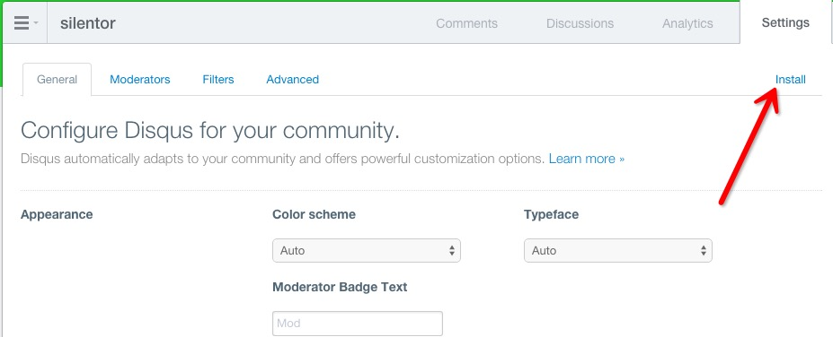
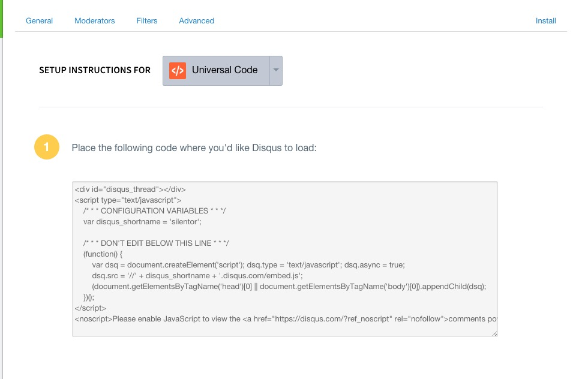

加入Disqus评论
------------

#### 1. 创建账号，访问[disqus.com](https://disqus.com/)

#### 2. 按提示，[创建一个website](https://disqus.com/admin/create/)


#### 3. 获取安装代码





#### 4. 部署代码

把代码复制到`主内容`和底部之间

```html
<!-- main -->
<div class="main" id="main">
    <div class="main-inner">
        <!-- 主内容 -->
        <div class="main-page markdown-body" id="main-page"></div>

        <!-- 代码放在这里 -->

        <!-- 底部 -->
        <div class="main-page-footer main-page markdown-body" id="main-page-footer"></div>
    </div>
</div>
```

#### NOTE

√ silentor自v1.5.4已经默认集成Disqus评论
